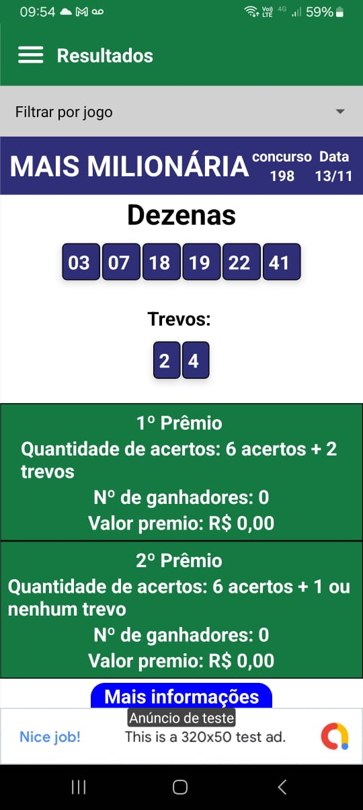
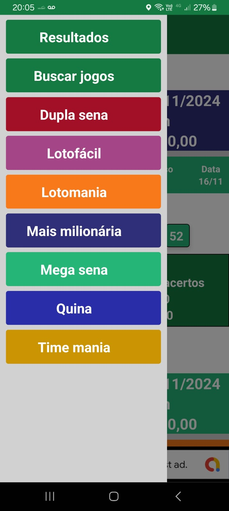
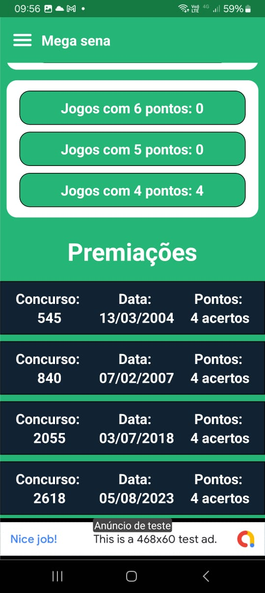
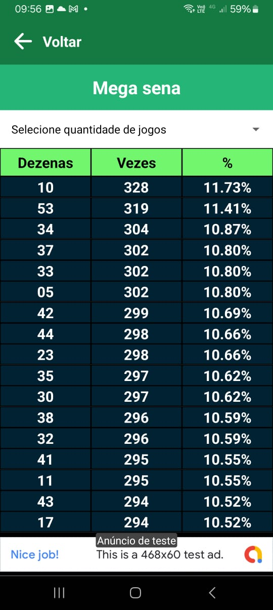
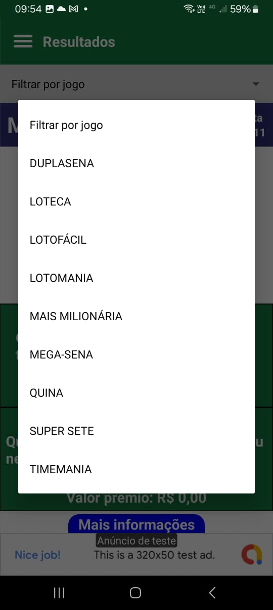

# Sobre o projeto
Projeto em react-native que realiza a comparação de jogos de loterias com os antigos resultados ja sorteado 

## 🛠️ Construído com

React-native 
javaScript

## tela resultados:

## tela menu de opções

## tela comparação mega sena

## tela dezenas mais sorteados megasena:

## tela filtro resultados:

