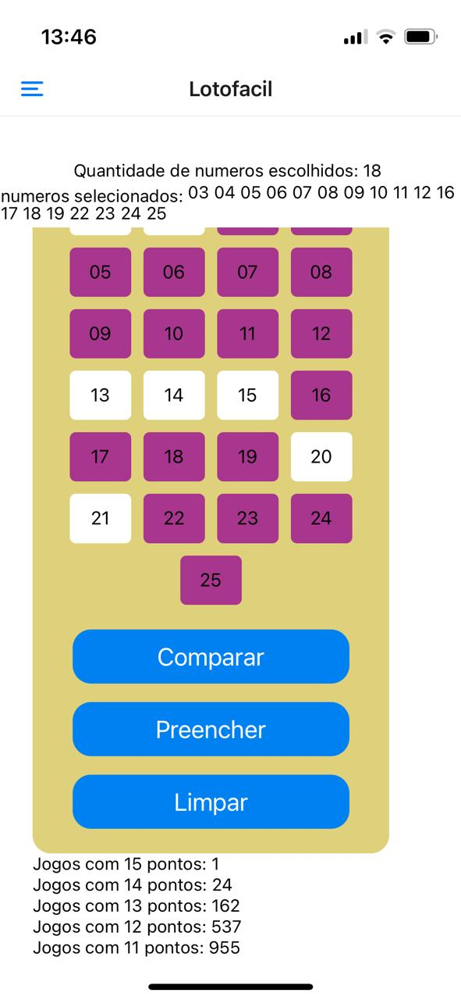
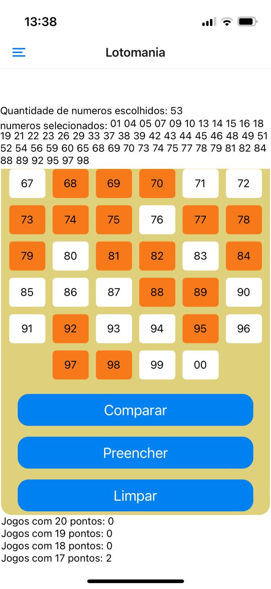
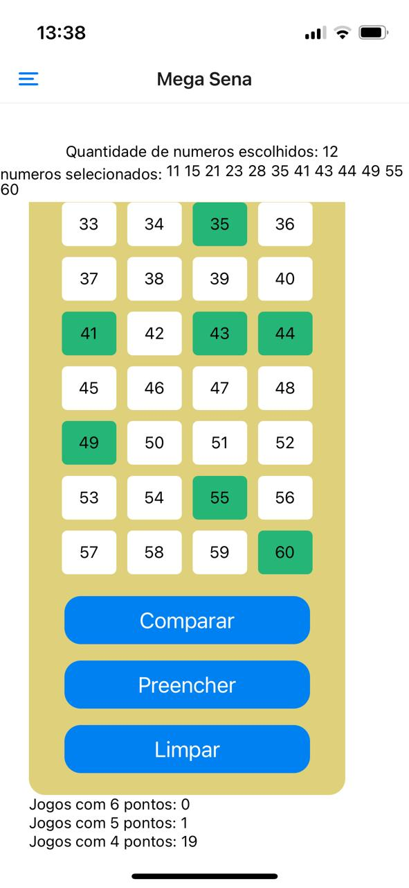
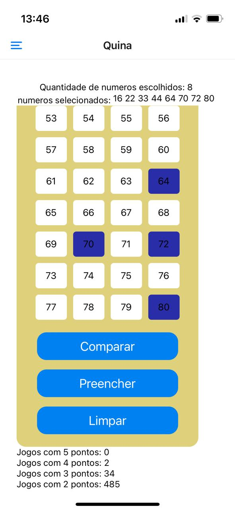
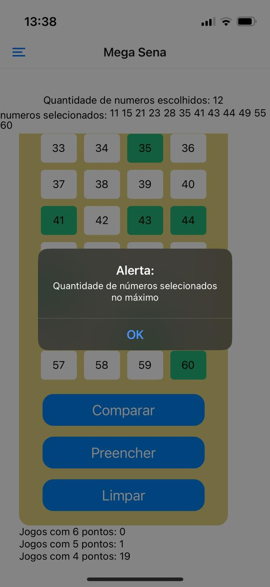

# Sobre o projeto
Projeto em react-native que realiza a comparação de jogos de loterias com os antigos resultados ja sorteado 

## 🛠️ Construído com

React-native 
javaScript

## tela home:

## tela lotofácil:

## tela lotomania: nada

## tela mega:

## tela quina:

## tela alerta de limite de números escolhidos:

